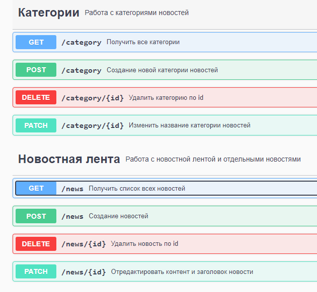
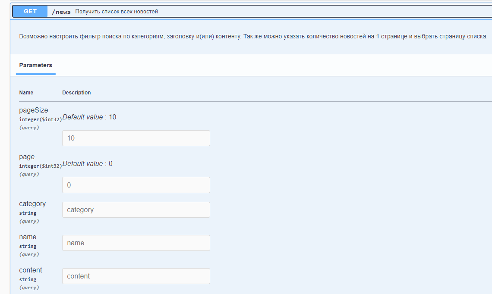
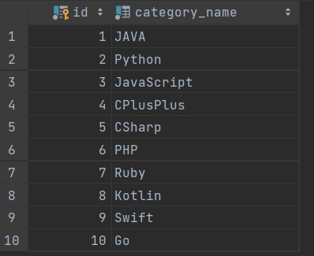
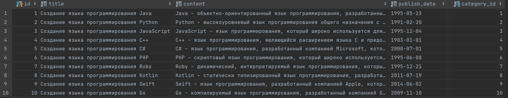
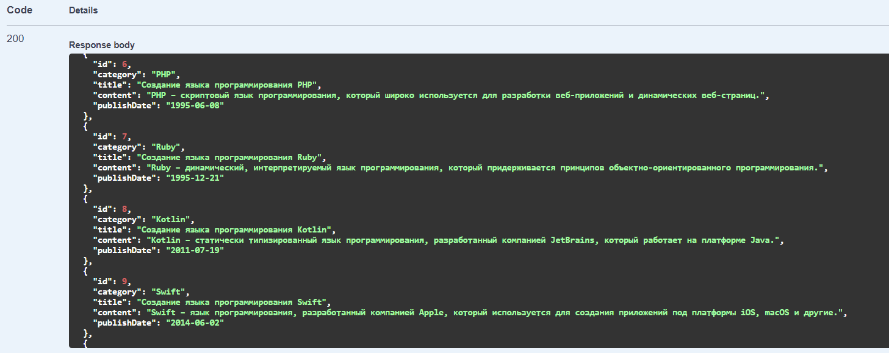

markdown
# Демонстрационный RESTFull проект - бэкэнд часть сайта новостной ленты

Позиция Java разработчика. Приложение для работы с новостными статьями.

## Запуск

Проект использует контейнеризацию с помощью Docker Compose для PostgreSQL и первичные скрипты по наполнению базы данных.
bash
In IDE:
1. Склонируйте git репозиторий  https://github.com/KaerLaende/NewsApp
2. Запустите Docker на вашем ПК
3. Откройте 'docker-compose.yaml' в проекте и запустите его ИЛИ введите 'docker-compose up' в терминале
4. Запустите 'NewsAppApplication.java'
## Конечные точки

SwaggerUI доступен после запуска приложения по адресу: [http://localhost:8080/swagger-ui/index.html](http://localhost:8080/swagger-ui/index.html)

## Функциональность

  Приложение предоставляет следующие возможности (CRUD-операции):

- просмотр списка новостей, разбитого на страницы с возможностью выбора количества отображаемых на странице новостей;
- поиск новостей по категории, названию и содержанию;
- создание и редактирование новостей;
- удаление новостей;
- просмотр списка всех категорий;
- создание категории;
- редактирование категории;
- удаление категории.

Особое внимание уделено получению списка новостей, сделана возможность указывать или не указывать фильтрацию по любой
из комбинаций с 3мя параметрами! А так же выводить список с разбивкой по страницам.

Для удобства пользователей и тестирования программы были созданы скрипты по заполнению Базы данных первичной информацией.
За основу взято 10 самых популярных языков програмирования и на их основе созданы первые категории: 

А в качестве новостей взяты публикации о создании этих языков программирования(дата публикации - выступает дата их создания):

 
Пример вывода всех новостных статей, без применения фильтра, но не более 5 новостей на странице и при запросе 2-ой странице:

## Стек

- Java 17
- Spring Boot 3
- Maven
- Hibernate
- Liquibase
- PostgreSQL
- Criteria API
- Lombok
- Mapstruct
- Swagger
- Junit & Mockito
  REST веб-приложение для управления лентой новостей на веб-сайте. Каждая новостная статья состоит из названия, содержания, даты публикации и категории, к которой относится новостная статья. Каждая категория содержит название, и к ней может быть привязано несколько новостных статей.
